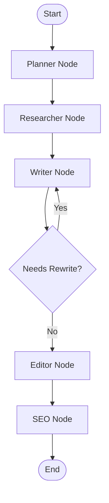

# Pipeline Architecture

This document describes the architectural design of the Content Generation Pipeline.

## 1. Core Architecture
The system is built as a stateful, multi-agent AI workflow using **LangChain** and **LangGraph**. It coordinates specialized AI agents that pass a shared state object through a directed graph.

We utilize **ChromaDB** as our local vector database for knowledge retrieval (RAG), and the **OpenAI API** as the backbone logic for the AI Agents.

## 2. Multi-Agent Workflow
We've abstracted the content creation process into 5 distinct agents governed by a LangGraph StateGraph.

### Graph Flow

### The State (`ContentState`)
The state is typed (`typing.TypedDict`) and holds inputs, intermediate artifacts, and logging metadata for the execution:
- **Core Inputs:** `content_request`, `settings` (tone, word count)
- **Agent Artifacts:** `brief`, `research_queries`, `draft_content`, `edited_content`, `seo_metadata`
- **Execution Metadata:** `request_id`, `started_at`, `token_usage`, `execution_times`, `errors`

## 3. Agent Responsibilities
Each agent extends `BaseAgent` which sets up the common LangChain interface, logging, and performance tracking logic.

1. **Planner (`PlannerAgent`)**: Parses user requirements and standardizes into a JSON Content Brief structure.
2. **Researcher (`ResearchAgent`)**: Generates research queries from the Brief, hits the RAG database, and synthesizes structured findings.
3. **Writer (`WriterAgent`)**: The creative heavy lifter. Fuses the content brief and research findings to generate the initial draft content.
4. **Editor (`EditorAgent`)**: Applies the style guide parameters and refines wording, flow, and grammatical accuracy without hallucinating new facts.
5. **SEO Optimizer (`SEOAgent`)**: Enhances keyword placement in the finalized content and generates complementary metadata tags (titles, descriptions, URL slugs).

## 4. Subsystems
### Logging & Auditing (`utils/logger.py` & `utils/audit.py`)
- Each pipeline execution receives a unique `request_id`.
- Handlers exist for rotating file logs and console output.
- `AuditLogger` extracts data post-execution, saving a snapshot of the pipeline event graph.

### Exporters & Output Management
- Content is generated primarily as Markdown.
- Dedicated exporters (`utils/exporters.py`) convert this internal format to fully styled HTML pages, JSON structured payloads, and decorated Markdown content.
- `OutputManager` standardizes directory paths by timestamp and slug, creating encapsulated session scopes.

### Quality System (`utils/quality.py`)
A standalone verification engine applied via the CLI. It uses `textstat` for reading difficulty scoring and analyzes structural parameters matching the final text up against the original `brief`.
